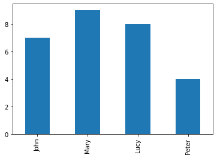
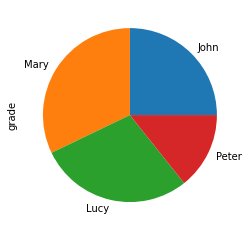
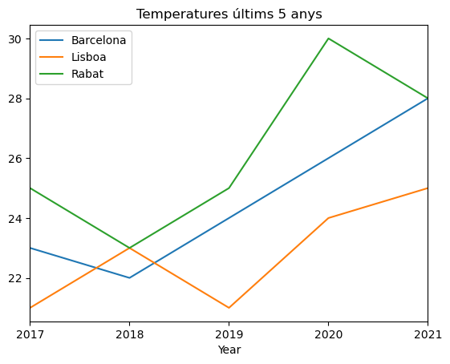
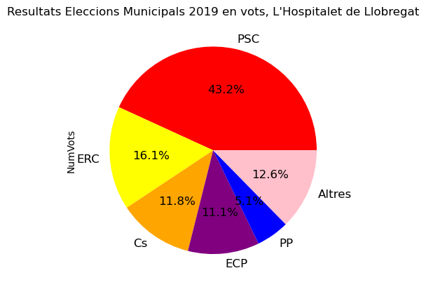

# Gràfiques amb Pandas

A estadística, existeixen 2 tipus:
  - Descriptiva (Gràfiques)
  - Inferencia (Previssions)

Per ajudar-nos en l'estadística que veurem, seria visualitzar i aprendre de la web [khan academy](https://es.khanacademy.org/ "khan academy").

Per realitzar gràfiques, tenim que instal·lar la llibreria **matplotlib**. 
Llibreria que utilitzara Pandas per sota, és una dependència de Pandas des de versions recents de Pandas. Per tant, no cal instal·lar-la apart.

**Comandes d'instal·lació, última versió estable.**

```shell
conda install -n bio -c anaconda matplotlib
```

<strike>
```shell
conda install -n bio -c conda-forge matplotlib
```
</strike>

A partir d'aqui seguirem el apartat de [plotting](https://pandas.pydata.org/pandas-docs/stable/user_guide/10min.html#plotting "plotting") al tutorial 10 minutes panda.

Posteriorment, seguim el tutorial [chart visualization](https://pandas.pydata.org/docs/user_guide/visualization.html)


### Exemple 1. Diagrama barres notes alumnes.

```python
import numpy as np 
import pandas as pd
import matplotlib.pyplot as plt

#np --> numerical panda, es una llibreria per a realitzar càlcul numèric
#les notes de dawbio amb series
student_list=["John","Mary","Lucy","Peter"]
grades_list = [7,9,8,4]
wants_dual_list = [False,True,False,True]
datos: dict[list] = {"grade": grades_list,
                   "dual": wants_dual_list}
students_frame = pd.DataFrame(
    index=student_list,
    data = datos
)
students_frame.loc[:,"grade"].plot(kind="bar")
plt.show()
```

>   <AxesSubplot:>
>





```python
#no aconsellable
students_frame.loc[:,"grade"].plot(kind="pie")
```


>   <AxesSubplot:ylabel='grade'>
>





### Exemple 2. Diagrama barres números aleatoris.

```python
# Continous vars, maje a dataframe with 2 columns
# Each column will have 100 random values (ints).
# Values will range from 10 to 100 (edat) or 1 to 100 (nota).

import numpy as np 
import pandas as pd

min_value_edat = 10
min_value_nota = 1
max_value = 100

df = pd.DataFrame({ 'edat' : np.random.randint(min_value_edat, max_value ,100),
    'nota' : np.random.randint(min_value_nota, max_value , size=100)})
df.loc[:,"nota"].plot(kind="bar")
```

>    <AxesSubplot:>
>


### Exemple 3. Diagrama de línies.

Basat en l'exemple [Basic Data Plotting.](https://pandas.pydata.org/docs/user_guide/visualization.html#basic-plotting-plot)

**Mostrar diagrama de línies de les temperatures mitjanes del juliol de 3 poblacions en els últims 5 anys.**

```python
# Creem el data_range dels últims 5 anys (anual).
range_20_last_years = pd.date_range("1/1/2017", periods=5, freq='A')

df = pd.DataFrame(
    index=range_20_last_years, 
    data= {
            "Barcelona":[23,22,24,26,28],
            "Lisboa":[21,23,21,24,25],
            "Rabat":[25,23,25,30,28],
        }
    )
df.index.name="Year"
# display(df)
df.plot(title="Temperatures últims 5 anys",legend=True);
```




### Exercici resolt Gràfics. Diagrama circular amb etiquetes (sense Pandas i amb Pandas).

Les dades les he obtingut manualment del mitjà:
https://www.naciodigital.cat/municipals2019/municipi/08101/hospitalet-llobregat

També s'haurien de poder extreure en fitxers CSV de portals de dades obertes, però no sempre estan actualitzats.

[Fitxer font, sense Pandas](exemple3-gcircular.py)

[Fitxer font, amb Pandas](exemple3-gcircular-pandas.ipynb)



